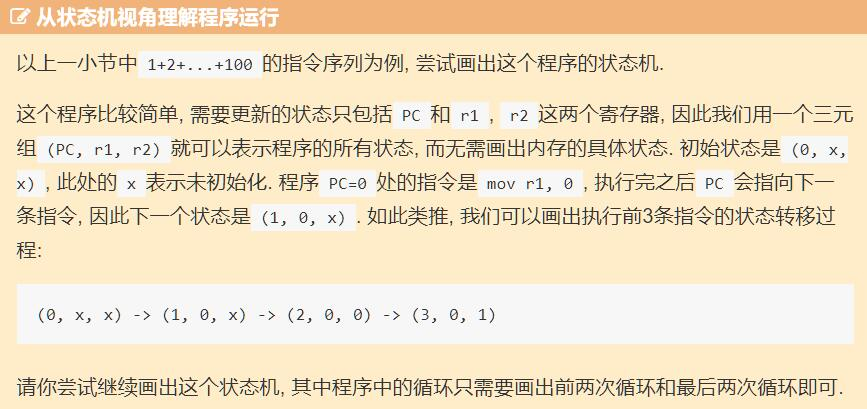

### NEMU是什么
<font color=red>个人理解：</font>是NJU编写的一个模拟器，名字来源于[QEMU（quick emulator)](https://zh.wikipedia.org/wiki/QEMU)。NEMU运行于GNU/Linux操作系统上，用C语言模拟了一个虚拟的计算机系统，包括CPU、内存、IO设备等。

```
                         +---------------------+  +---------------------+
                         |     Super Mario     |  |    "Hello World"    |
                         +---------------------+  +---------------------+
                         |    Simulated NES    |  |      Simulated      |
                         |       hardware      |  |       hardware      |
+---------------------+  +---------------------+  +---------------------+
|    "Hello World"    |  |     NES Emulator    |  |        NEMU         |
+---------------------+  +---------------------+  +---------------------+
|      GNU/Linux      |  |      GNU/Linux      |  |      GNU/Linux      |
+---------------------+  +---------------------+  +---------------------+
|    Real hardware    |  |    Real hardware    |  |    Real hardware    |
+---------------------+  +---------------------+  +---------------------+
          (a)                      (b)                     (c)
```
图(c)中NEMU和Simulated hardware之间应该还有一层抽象计算机层，描述一个计算机系统需要有哪些硬件和接口。有了抽象计算机层，可以实现
多种不同指令架构集的计算机而不改变虚拟机器上层程序的设计形式。

手册给了x86、riscv32和mips32三种指令集选择，选了mips32

---
### 计算机可以没有寄存器吗
#### 回答这个问题之前先看看MIPS32手册
1. MIPS32架构定义了CPU寄存器和FPU寄存器：
   - CPU寄存器包括r0 ~ r31，共32个通用寄存器；Program Counter；HI/LO（存放乘除指令结果）。r0可以代表默认0，r31在 **JAL, BLTZAL, BLTZALL, BGEZAL, BGEZALL** 指令中表示默认目标地址。
   - FPU寄存器包括32个通用寄存器，存放单精度浮点数；5个控制寄存器（暂时不清楚用法）。
2. MIPS32默认是小端序
3. 对齐策略：
   - 半字（2 byte）数据要对齐0，2，4...
   - 字数据（4 byte）数据对齐0，4，8...
   - 双字数据（8 byte）数据对齐0，8，16...
#### 个人思考
计算机的寄存器用于暂存数据和指令，如果没有寄存器，那就需要其他介质作为替代，比如内存。如果没有内存，也可以是外部指令流输入控制计算机运行，但是为了暂存中间结果，始终需要有一个存储器模块。

MIPS手册描述了编程模型的6个方面：
- CPU数据形式：
  - bit
  - 字节
  - 半字
  - 字
  - 双字
- 协处理器
  - CP0：用于虚拟地址转换、异常处理、核心调度、控制cache系统、故障恢复等
  - CP1：保留用于浮点处理器FPU
  - CP2：作特殊用途
  - CP3：保留用于MIPS64架构
- CPU寄存器有哪些
- FPU数据形式
  - 32位单精度浮点数
  - 32位单精度浮点数 paired-single（没理解意思）
  - 64位双精度浮点数
  - 32位定点字
  - 64位顶点字
- 字节序和大小端
- 内存访问类型

如果不存在寄存器，CPU的数据处理形式并不受影响，协处理器工作不受影响，CPU中的程序计数器PC功能需要由其他硬件支持，通用寄存器暂存功能需要由其他硬件支持，FPU的数据处理形式不受影响，字节序和大小端仍然需要定义，内存访问类型仍然需要定义。

### 从状态机视角理解程序运行

图灵机的基础：当前状态+当前输入 -> 状态转移 -> 下一状态
```
// PC: instruction    | // label: statement
0: mov  r1, 0         |  pc0: r1 = 0;
1: mov  r2, 0         |  pc1: r2 = 0;
2: addi r2, r2, 1     |  pc2: r2 = r2 + 1;
3: add  r1, r1, r2    |  pc3: r1 = r1 + r2;
4: blt  r2, 100, 2    |  pc4: if (r2 < 100) goto pc2;   // branch if less than
5: jmp 5              |  pc5: goto pc5;
```

```
(PC, r1, r2) : (0, x, x) -> (1, 0, x) -> (2, 0, 0) -> (3, 0, 1)
-> (4, 1, 1) -> (2, 1, 1) -> (3, 1, 2) -> (4, 3, 2) -> (2, 3, 2)
-> (3, 3, 3) -> (4, 6, 3) -> (2, 6, 3) -> ... -> (4, 4851, 99) 
-> (2, 4950, 99) -> (3, 4950, 100) -> (4, 5050, 100) 
-> (5, 5050, 100) (end)
```


 

